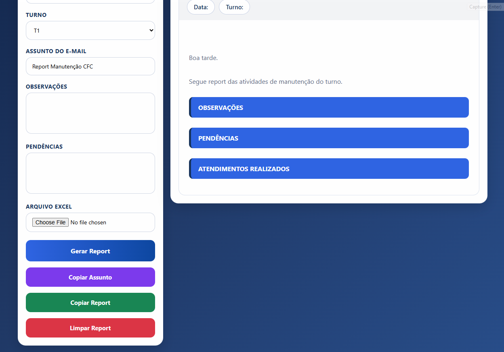
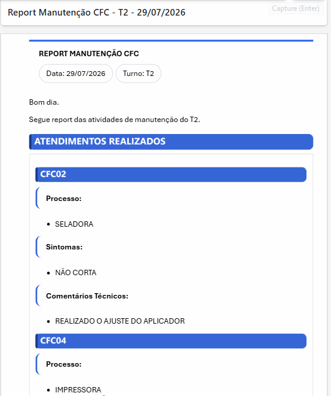

# Report Manutenção CFC

Sistema web desenvolvido para automatizar a geração de relatórios de manutenção a partir de planilhas Excel.

## Objetivo

Facilitar a criação de relatórios operacionais de manutenção, reduzindo tempo de preenchimento manual e padronizando as informações enviadas por e-mail.

## Preview

### Tela Principal

### Importação de Excel

### Relatório Gerado

## Principais Funcionalidades

✅ Importação de planilhas Excel

✅ Filtragem por turno

✅ Geração automática de relatórios

✅ Formatação para envio por e-mail

✅ Interface amigável

✅ Automação de processos da manutenção

## Tecnologias Utilizadas

- HTML5
- CSS3
- JavaScript
- Excel
## Versões

### v1.1.0
- Separação dos atendimentos em 3 colunas.
- Processo, Sintoma e Comentário Técnico independentes.
- Ajuste da largura da coluna Processo.
- Correção da quebra de linha para nomes maiores.
- Melhor alinhamento entre Preview e Outlook.

## Novo Layout dos Atendimentos (v1.1.0)

Agora os atendimentos são exibidos em três colunas independentes:

- Processo
- Sintomas
- Comentários Técnicos

report_layout_3_colunas.png

### v1.0.0
- Primeira versão do Report CFC.
- Importação de Excel.
- Geração automática do report.
- Cópia para Outlook.
## Autor

William Lopes
``
